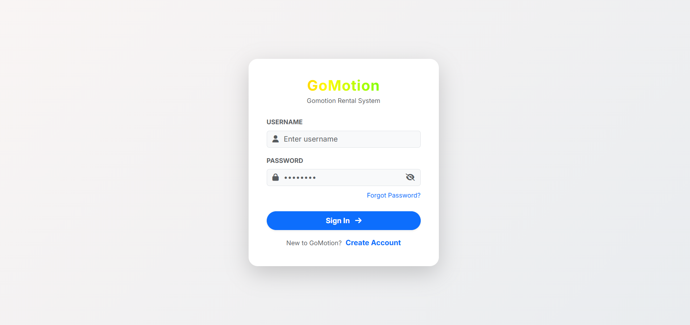
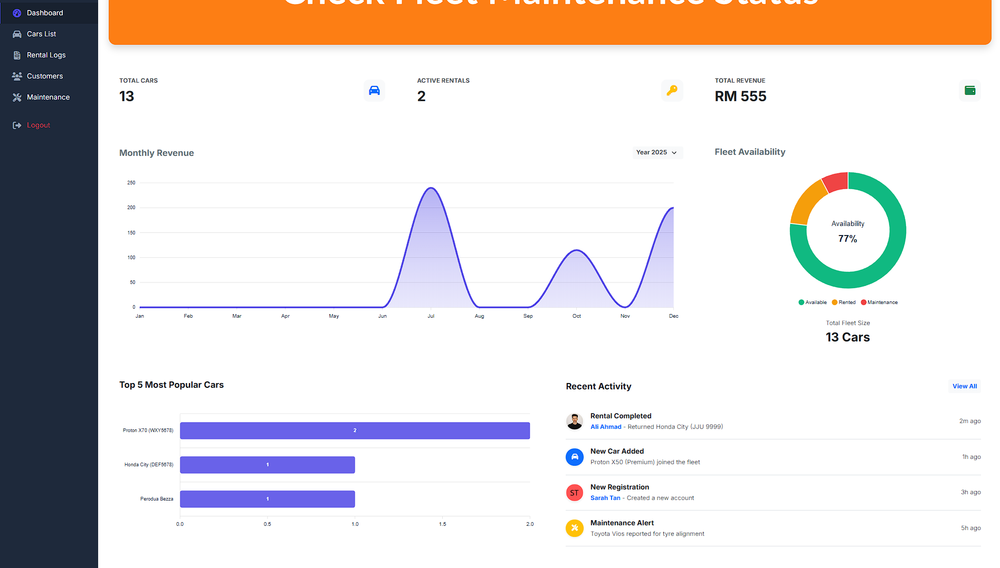
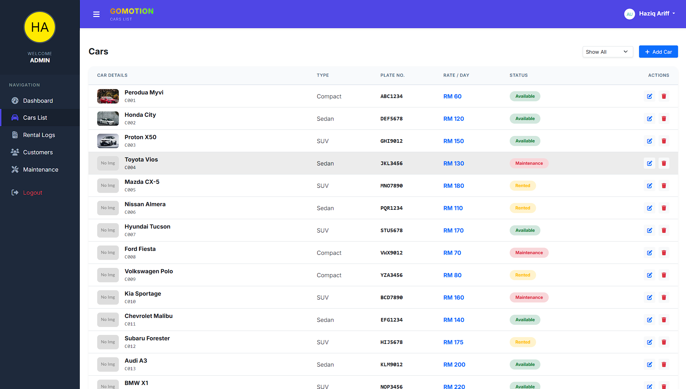

# GoMotion - Car Rental Management System

**Course:** IMS566 - Advanced Web Design Development and Content Management  
**Program:** CDIM262 - Bachelor of Information Science (Hons.) Information System Management  
**Institution:** Universiti Teknologi MARA (UiTM), Puncak Perdana

---

## 👨‍💻 Developed By

- **Muhammad Haziq**
- **Safa Raziq**

---

## 🔗 Live Demo

🚀 **View Live Site:** [https://haziqariff703.github.io/go_motion/](https://haziqariff703.github.io/go_motion/)

> _Note: Use the credentials below to log in._

---

## 📖 Project Overview

**GoMotion** is a professional, responsive web-based administration dashboard designed for car rental businesses. It allows fleet managers to track vehicle inventory, monitor active rentals, and visualize financial performance in real-time.

This project demonstrates **Advanced Front-End Development** skills by using dynamic DOM manipulation and **LocalStorage** to simulate a full-stack application experience without a backend database.

---

## 📸 Project Screenshots

### 1. Secure Login

_(Authentication page with validation and error handling)_


### 2. Admin Dashboard

_(Real-time KPIs, revenue charts, and fleet availability status)_


### 3. Fleet Management

_(Inventory list with status filtering and management actions)_


---

## ✅ Key Features

### 1. Authentication & Security

- **Simulated Login:** Validates credentials (`admin` / `1234`) before granting access.
- **Session Protection:** Restricts access to internal pages (Dashboard, Cars, etc.) unless logged in.
- **Secure Logout:** Includes a confirmation modal to prevent accidental session termination.

### 2. Interactive Dashboard

- **Real-Time KPIs:** Automatically calculates Total Fleet, Active Rentals, and Revenue.
- **Data Visualization:**
  - **Revenue Chart:** Area chart showing monthly income trends.
  - **Fleet Status:** Donut chart displaying Available vs. Rented cars.
  - **Top Models:** Bar chart ranking the most popular vehicles.

### 3. Comprehensive Data Management (CRUD)

- **🚗 Cars List:** Add, edit, and remove vehicles. Status updates (e.g., "Maintenance") automatically block rentals.
- **📄 Rental Logs:** Track customer bookings, dates, and payment status (Paid/Pending).
- **🔧 Maintenance:** Log service records. Setting a car to "In Progress" automatically marks it as unavailable.
- **👥 Customers:** Manage registered user database.

### 4. Professional UI/UX

- **Responsive Design:** Fully functional on Desktop, Tablet, and Mobile (collapsible sidebar).
- **Dark Mode:** Built-in theme switcher (Light / Dark / Auto) that persists user preference.
- **Danger Zone:** A "Factory Reset" feature in Settings to wipe data and restore defaults.

---

## 🛠️ Tech Stack

- **HTML5:** Semantic structure.
- **CSS3:** Custom theming combined with **Bootstrap 5.3**.
- **JavaScript (ES6):** Modular architecture (`data.js`, `auth.js`, `logic.js`) for clean, maintainable code.
- **ApexCharts.js:** For responsive data visualization.
- **FontAwesome 6:** For modern vector icons.
- **LocalStorage:** For client-side data persistence.

---

## 💻 Installation & Usage

1. **Clone the Repository**
   ```bash
   git clone [https://github.com/haziqariff703/go_motion.git](https://github.com/haziqariff703/go_motion.git)
   Open the Project Navigate to the folder and double-click index.html to open it in your browser.
   ```

Login Use the following demo credentials:

Username: admin

Password: 1234

## 📂 Project Structure

/
├── index.html # Login Page
├── dashboard.html # Main Overview (Charts & KPIs)
├── cars.html # Vehicle Inventory
├── rentals.html # Rental Transaction Logs
├── customers.html # Customer Database
├── maintenance.html # Service Logs
├── profile.html # Admin Profile
├── settings.html # System Settings (Theme/Reset)
├── css/
│ ├── style.css # Layout & Component Styles
│ └── themes.css # Color Variables & Dark Mode
├── js/
│ ├── auth.js # Login/Logout Logic
│ ├── data.js # LocalStorage Data Engine
│ ├── dashboard.js # Charts & Statistics
│ ├── logic.js # CRUD Operations
│ ├── main.js # Sidebar & Global Init
│ └── render.js # HTML Table Generators
└── images/ # Assets
